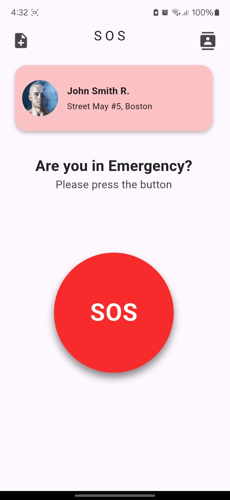
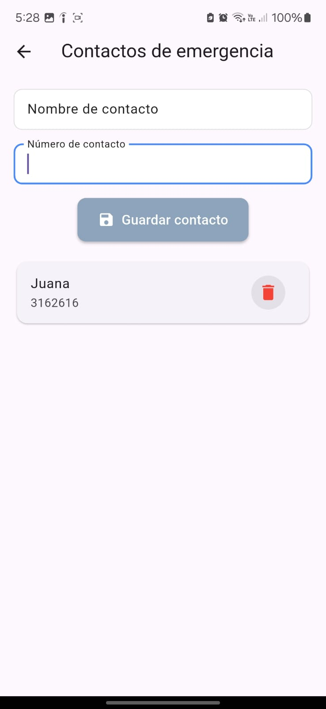
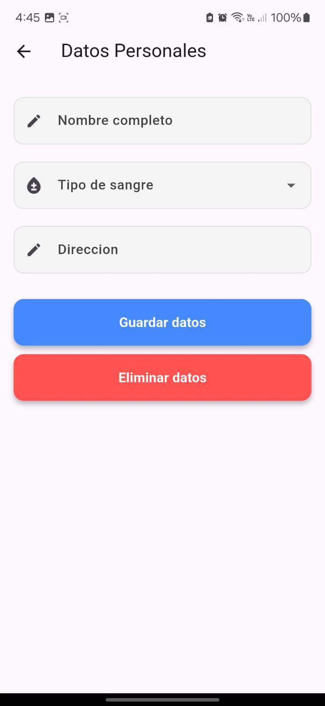
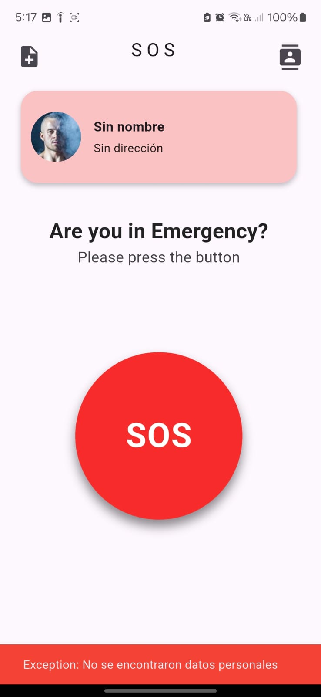
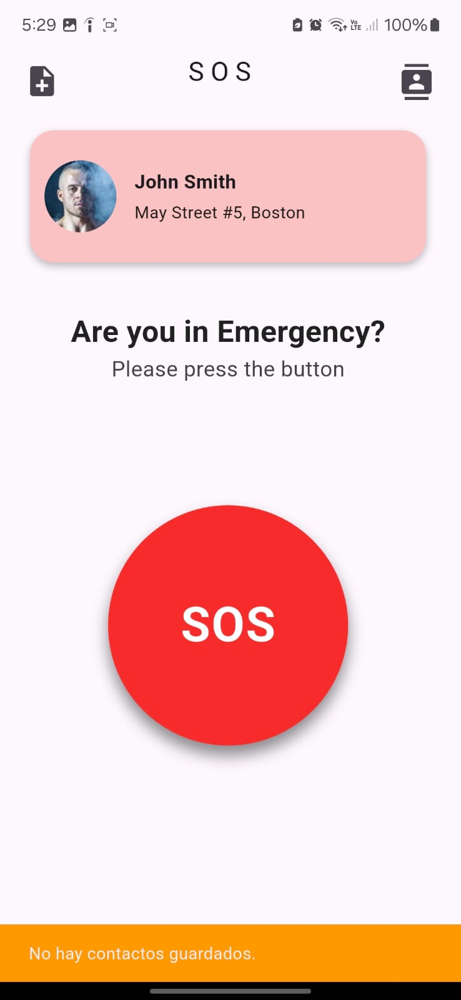
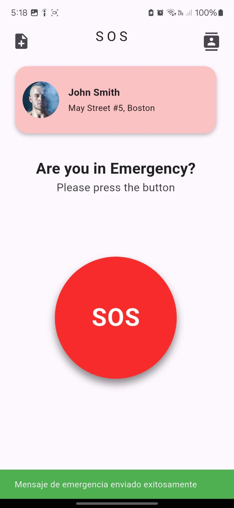
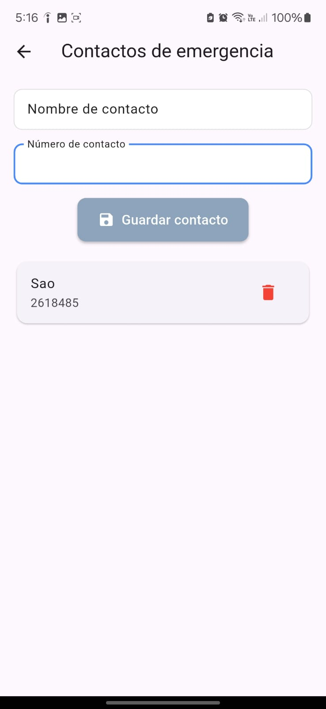
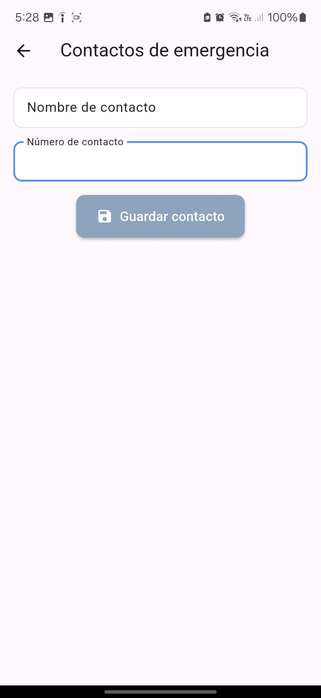
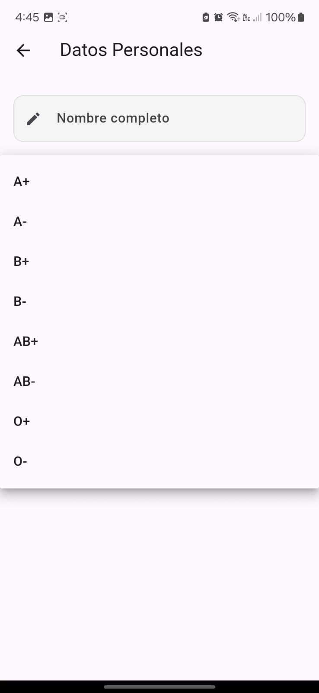

# 🆘 EmergencyButton_DEMO

**EmergencyButton_DEMO** es una aplicación móvil sencilla desarrollada con **Flutter** que permite enviar mensajes de emergencia con ubicación a los contactos guardados, simulando un escenario de ayuda rápida en situaciones críticas.

---

## 🚀 Características principales

- ✅ Registro de **contactos de emergencia** (nombre y número).
- ✅ Registro de **datos personales** (nombre, tipo de sangre, dirección, etc.).
- ✅ Obtención de **ubicación actual** mediante servicio REST.
- ✅ Envío simulado de SMS de emergencia a los contactos registrados.
- ✅ Manejo de errores si no hay datos personales o contactos disponibles.
- ✅ Eliminación de datos personales o contactos.

---

## 🛠️ Buenas prácticas aplicadas

- Arquitectura **limpia y separada por capas**:
  - `services/`, `repositories/`, `models/`, `requests/`, `http/`
- Uso de modelos y `toJson/fromJson` para comunicación clara con el backend.
- Validaciones con formularios (`TextFormField`) modernos.
- Manejo de estados con `setState` y métodos asincrónicos (`Future`, `await`).
- Uso de **Dropdowns estilizados** para selección de tipo de sangre.
- Interfaz limpia y con navegación fluida entre pantallas.

---

## 🖼️ Capturas de pantalla

| Home | Lista de contactos | Datos personales |
|------|--------------------|------------------|
|  |  |  |

| Error sin datos personales | Error sin contactos | Éxito en envío |
|----------------------------|---------------------|----------------|
|  |  |  |

| Agregar contacto | Lista vacía | Dropdown tipo de sangre |
|------------------|-------------|--------------------------|
|  |  |  |
